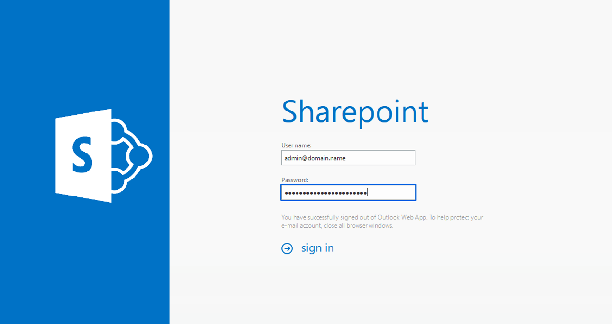

> [!primary]
> Diese Übersetzung wurde durch unseren Partner SYSTRAN automatisch erstellt. In manchen Fällen können ungenaue Formulierungen verwendet worden sein, z.B. bei der Beschriftung von Schaltflächen oder technischen Details. Bitte ziehen Sie im Zweifelsfall die englische oder französische Fassung der Anleitung zu Rate. Möchten Sie mithelfen, diese Übersetzung zu verbessern? Dann nutzen Sie dazu bitte den Button "Beitragen" auf dieser Seite.
>

## Ziel

Wenn Sie die Daten Ihres OVHcloud SharePoint sichern oder migrieren möchten, finden Sie in dieser Anleitung die notwendigen Schritte, um alle Daten auf den lokalen Speicherplatz Ihres Computers zu extrahieren.

**Diese Anleitung erklärt, wie Sie die Daten Ihres OVHcloud SharePoint auf Ihrem Computer sichern.**

## Voraussetzungen

- Sie haben Zugriff auf Ihr [OVHcloud Kundencenter](https://www.ovh.com/auth/?action=gotomanager&from=https://www.ovh.de/&ovhSubsidiary=de).
- Sie haben eine [OVHcloud SharePoint-Lösung](https://www.ovhcloud.com/de/collaborative-tools/sharepoint/) abonniert.
- Sie verfügen über einen Computer, der das Betriebssystem Microsoft Windows für die Durchführung der Migrationsschritte verwendet.

## In der praktischen Anwendung

Diese Anleitung gliedert sich in 4 Schritte:

- [Schritt 1 - OneDrive for Business installieren](#installonedrive): Mit *OneDrive for Business* können Sie Daten von Ihrem SharePoint auf Ihren Computer übertragen.
- [Schritt 2 - Migration im OVHcloud Kundencenter vorbereiten](#controlpanelconfig): Konfigurieren von SharePoint mit einem Administrator-Account, der den Inhalt von OneDrive für jeden SharePoint-Account übertragen kann.
- [Schritt 3 - Migration über das SharePoint-Interface](#migrationignition): Melden Sie sich mit dem Administrator-Account an, um den Inhalt auf Ihren Computer zu übertragen.
- [Schritt 4 - Inhalte anderer SharePoint-Accounts migrieren](#migrationother): Speicherplatz jedes Accounts von SharePoint anzeigen und synchronisieren.

### Schritt 1 - OneDrive for Business installieren 

Um die Daten Ihres OVHcloud SharePoint zu migrieren, müssen Sie die Anwendung *OneDrive for Business* verwenden, deren Dateiname „Groove.exe“ lautet.

Folgen Sie diesen Schritten, um das Programm zu installieren:

1. ISO-Datei über den Link herunterladen <https://download.mail.ovh.net/sharepoint/onedrive.iso>.
2. Klicken Sie rechts auf die Datei `onedrive.iso`, öffnen Sie deren `Eigenschaften`{.action}, aktivieren Sie `Entsperren`{.action}, klicken Sie auf `Übernehmen`{.action} und dann auf `OK`{.action}.
3. Doppelklicken Sie auf `onedrive.iso`.
4. Doppelklicken Sie auf die Datei `setup.bat`, um die Installation zu starten.
5. Dies kann einige Minuten dauern. **Warten Sie, bis das Fenster geschlossen** ist, um die Installation abzuschließen.

> [!warning]
>
> Wenn die Datei `setup.bat` nicht korrekt gestartet wird (in Schritt 4), können Sie den Inhalt der Datei `onedrive.iso` in ein Verzeichnis Ihres Computers kopieren und Schritt 4 wiederholen.

{.thumbnail}

> [!primary]
>
> Wenn diese Methode auf Ihrem Computer nicht funktioniert, können Sie *OneDrive for Business* gemäß [der offiziellen Vorgehensweise von Microsoft](https://learn.microsoft.com/sharepoint/install-previous-sync-app#install-groove-exe-with-office-2016) installieren.

### Schritt 2 - Migration über das OVHcloud Kundencenter vorbereiten 

Um auf alle OneDrive-Bereiche Ihres SharePoint-Dienstes zuzugreifen, müssen Sie das Administratorrecht für alle Benutzer über Ihr [OVHcloud Kundencenter](https://www.ovh.com/auth/?action=gotomanager&from=https://www.ovh.de/&ovhSubsidiary=de) entfernen.

Gehen Sie in Ihrem Kundencenter in den Bereich `Web Cloud`{.action}. Klicken Sie auf `Microsoft`{.action}, klicken Sie auf `SharePoint`{.action}, und wählen Sie den gewünschten Dienst aus.

Greifen Sie über den Tab `Benutzer`{.action} auf die Accountverwaltung zu. Klicken Sie für jeden Account auf den Button `...`{.action} rechts und dann auf `Administratorrechte entziehen`{.action}.

{.thumbnail}

Sobald die Administratorrechte für alle SharePoint-Accounts entzogen wurden, müssen Sie einen Account festlegen, der Zugriff auf alle OneDrive-Bereiche des Dienstes hat.

Aktivieren Sie die Administratorberechtigung für diesen Account.

Klicken Sie im Tab `Benutzer`{.action} auf den Button `...`{.action} rechts neben dem Account und danach auf `Administratorrechte aktivieren`{.action}.

{.thumbnail}

Sie können jetzt alle OneDrive-Bereiche Ihres SharePoint über diesen Account synchronisieren.

### Schritt 3 - Migration über Ihr SharePoint-Interface starten 

Greifen Sie auf das Online-Interface Ihres SharePoint-Dienstes zu. Den Link dazu finden Sie in Ihrem OVHcloud Kundencenter im Tab `Allgemeine Informationen`{.action} unter `URL`.

{.thumbnail}

Loggen Sie sich mit den Anmeldeinformationen des Benutzers ein, der über Administratorrechte verfügt.

{.thumbnail}

Um zum OneDrive-Bereich zu gelangen, klicken Sie auf das Symbol oben links in der SharePoint-Oberfläche und dann auf das `OneDrive`{.action}-Symbol.

{.thumbnail}

Um OneDrive-Inhalte mit Ihrem Computer zu synchronisieren, klicken Sie auf die Schaltfläche `Synchronisieren`{.action} und dann auf `Jetzt synchronisieren`{.action}.

{.thumbnail}

Es wird ein Fenster angezeigt, um die Berechtigung zum Öffnen des **grvopen**-Links zu erteilen. Aktivieren Sie dazu "Always allow **https://myServiceAddress.spX.ovh.net** to open **grvopen** links" und klicken Sie dann auf `Open Link`{.action}.

{.thumbnail}

Geben Sie die Anmeldeinformationen für den Administrator-Account von SharePoint ein, der in [Schritt 2](#controlpanelconfig) konfiguriert wurde.

{.thumbnail}

Klicken Sie auf `Sync Now`{.action}.

{.thumbnail}

Wählen Sie die Bibliotheksvorlage **Form Templates** aus dem Fenster "Select the library you want to sync". Klicken Sie dann auf `Sync selected`{.action}.

{.thumbnail}

Nach Abschluss der Synchronisierung auf dem Computer werden nur die Daten des SharePoint-Accounts, mit dem Sie verbunden sind, auf den Computer übertragen.

**Um den Inhalt von jedem OneDrive-Account auf Ihrem SharePoint zu übertragen, folgen Sie Schritt 4.**

### Schritt 4 - Inhalte anderer SharePoint-Accounts migrieren 

Um auf den OneDrive-Bereich anderer SharePoint-Benutzer zuzugreifen und die zugehörigen Daten zu synchronisieren, müssen Sie die URL zum Zugriff (über Ihren Browser) bearbeiten, wenn Sie beim OneDrive des Administrator-Accounts angemeldet sind.

Ersetzen Sie hierzu in der angezeigten URL die Sektion für den Benutzer zwischen den Abschnitten `/personal/` und `/Documents/`.

- **Beispiel 1**: Für den Benutzer **user@domain.name** müssen die Zeichen „**@**“ und „**.**“ mit „**_**“ ersetzt werden. So erhalten Sie „user_domain_name“. Daher sieht der Link folgendermaßen aus:

{.thumbnail}

- **Beispiel 2**: Für den Benutzer **john.smith@example.com** wird „john_smith_example_com“ angezeigt. Ihr Link sieht folgendermaßen aus:

{.thumbnail}

> [!warning]
>
> Die obigen URLs dienen nur als Beispiel. Achten Sie darauf, die von Ihrem SharePoint generierte URL zu verwenden.

Sie können weiere Accounts synchronisieren, indem Sie diesen Schritt wiederholen.

## Weiterführende Informationen

[OVHcloud SharePoint aktivieren und verwalten](/pages/web_cloud/email_and_collaborative_solutions/microsoft_sharepoint/sharepoint_manage)

Kontaktieren Sie für spezialisierte Dienstleistungen (SEO, Web-Entwicklung etc.) die [OVHcloud Partner](https://partner.ovhcloud.com/de/directory/).

Wenn Sie Hilfe bei der Nutzung und Konfiguration Ihrer OVHcloud Lösungen benötigen, beachten Sie unsere [Support-Angebote](https://www.ovhcloud.com/de/support-levels/).

Für den Austausch mit unserer User Community gehen Sie auf <https://community.ovh.com/en/>.
