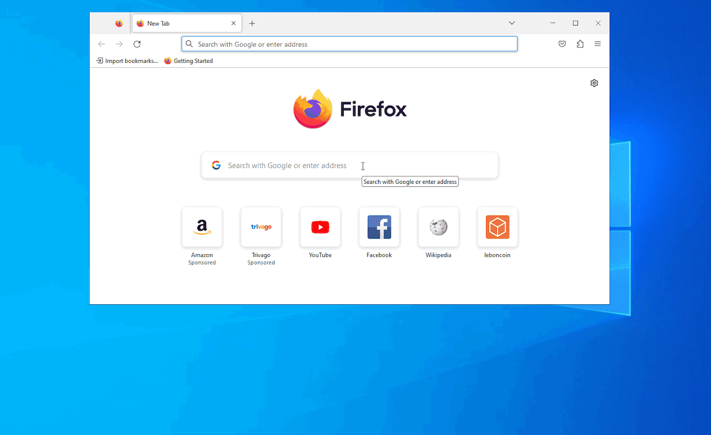

> [!primary]
> Questa traduzione è stata generata automaticamente dal nostro partner SYSTRAN. I contenuti potrebbero presentare imprecisioni, ad esempio la nomenclatura dei pulsanti o alcuni dettagli tecnici. In caso di dubbi consigliamo di fare riferimento alla versione inglese o francese della guida. Per aiutarci a migliorare questa traduzione, utilizza il pulsante "Contribuisci" di questa pagina.
>

## Obiettivo

Per recuperare o migrare i dati della piattaforma sharepoint OVHcloud, questa guida ti mostra la procedura da seguire per estrarre tutti i dati verso lo storage locale del tuo computer.

**Questa guida ti mostra come effettuare il backup dei dati di Sharepoint OVHcloud sul tuo computer.**

## Prerequisiti

- Avere accesso allo [Spazio Cliente OVHcloud](https://www.ovh.com/auth/?action=gotomanager&from=https://www.ovh.it/&ovhSubsidiary=it)
- Disporre di una [soluzione Sharepoint OVHcloud](https://www.ovhcloud.com/it/collaborative-tools/sharepoint/)
- Disporre di un computer che utilizzi il sistema operativo Microsoft Windows per eseguire i passaggi di migrazione.

## Procedura

Questa guida è suddivisa in 4 step:

- [Step 1 - Installa OneDrive for Business](#installonedrive): la soluzione OneDrive for Business consente di trasferire i dati da Sharepoint al computer
- [Step 2 - Prepara la migrazione dallo Spazio Cliente OVHcloud](#controlpanelconfig): configura la tua piattaforma Sharepoint designando un unico account amministratore che sarà in grado di trasferire il contenuto di OneDrive di ogni account Sharepoint.
- [Step 3 - Avvia la migrazione dall’interfaccia Sharepoint](#migrationignition): accedi all’account indicato nello Step 2 per trasferire il contenuto nel tuo computer.
- [Step 4 - Migra il contenuto degli altri account Sharepoint](#migrationother): segui il processo che permette di visualizzare e sincronizzare lo spazio OneDrive di ogni account sulla tua piattaforma Sharepoint.

### Step 1 - Installa OneDrive Entreprise 

Per migrare i dati del servizio SharePoint di OVHcloud è necessario utilizzare l’applicazione OneDrive Entreprise con il nome tecnico "Groove.exe".

Per installarlo, segui le istruzioni qui sotto:

1. Scarica il file ISO dal link <https://download.mail.ovh.net/sharepoint/onedrive.iso>
2. Dal computer, fare clic con il pulsante destro del mouse sul file `onedrive.iso`, aprire le relative `Proprietà`{.action}, selezionare la casella di controllo `Sblocca`{.action}, fare clic su `Applica`{.action} e quindi su `OK`{.action}.
3. Fare doppio clic su `onedrive.iso` per aprirlo.
4. Fare doppio clic sul file `setup.bat` per avviare l'installazione.
5. L’operazione potrebbe richiedere alcuni minuti. **Attendi la chiusura** della finestra prima di completare l’installazione.

> [!warning]
>
> Se il file `setup.bat` non si avvia correttamente (passaggio 4), è possibile copiare il contenuto del file `onedrive.iso` in una cartella sul desktop del computer e riprovare al passaggio 4.

{.thumbnail}

> [!primary]
>
> Se il metodo non funziona nel computer, è possibile installare OneDrive for Business seguendo [la procedura ufficiale Microsoft](https://learn.microsoft.com/sharepoint/install-previous-sync-app#install-groove-exe-with-office-2016).

### Step 2 - Prepara il trasferimento dallo Spazio Cliente OVHcloud 

Per accedere a tutti gli spazi OneDrive all’interno del servizio Sharepoint, è necessario rimuovere il diritto di amministratore di tutti gli utenti dallo [Spazio Cliente OVHcloud](https://www.ovh.com/auth/?action=gotomanager&from=https://www.ovh.it/&ovhSubsidiary=it).

Accedi alla sezione `Web Cloud`{.action} del tuo Spazio Cliente OVH. Clicca su `Microsoft`{.action}, poi su `SharePoint`{.action} e seleziona il servizio SharePoint interessato.

Dalla scheda `Utenti`{.action}, accedi alla gestione degli account Sharepoint della tua piattaforma. Per ogni account, clicca sul pulsante `...`{.action} a destra e poi su `Rimuovi diritti amministratore`{.action}.

{.thumbnail}

Una volta revocato il diritto di amministratore per tutti gli account Sharepoint, è necessario designare un solo account che avrà accesso a tutti gli spazi OneDrive della piattaforma.

Attivare il diritto amministratore per l'account designato.

Sempre nella scheda `Utenti`{.action} della piattaforma Sharepoint, clicca sul pulsante `...`{.action} a destra dell’account designato e poi su `Attiva i diritti di amministratore`{.action}.

{.thumbnail}

A questo punto è possibile sincronizzare tutti gli spazi OneDrive della piattaforma Sharepoint utilizzando questo account.

### Step 3 - Avvia la migrazione dall’interfaccia Sharepoint 

Accedi all’interfaccia online del tuo servizio SharePoint. L’URL di accesso è disponibile nello Spazio Cliente OVHcloud, scheda `Informazioni generali`{.action}, sotto la voce `URL`.

{.thumbnail}

Accedere con le credenziali dell'utente con diritti di amministratore.

{.thumbnail}

Per accedere alla sezione OneDrive, clicca sull’icona in alto a sinistra dell’interfaccia Sharepoint e poi clicca sull’icona `OneDrive`{.action}.

{.thumbnail}

Per sincronizzare il contenuto di OneDrive con il computer, fare clic sul pulsante `Sync`{.action} e quindi scegliere `Sync Now`{.action}.

{.thumbnail}

Viene visualizzata una finestra che consente al sito di aprire il collegamento **grvopen**. Per autorizzarlo, spunta la voce "Always allow **https://myServiceAddress.spX.ovh.net** to open **grvopen** links" e clicca su `Open link`{.action}.

{.thumbnail}

Inserire gli identificativi dell'account amministratore di Sharepoint. Utilizza l'utente con i diritti di amministratore (configurato allo [Step 2](#controlpanelconfig)).

{.thumbnail}

Fare clic su `Sync Now`{.action}.

{.thumbnail}

Scegliere il modello di libreria **Form Templates** dalla finestra "Select the library you want to sync". Clicca su `Sync selected`{.action}.

{.thumbnail}

Una volta completata la sincronizzazione, nel computer verranno trasferiti solo i dati dell'account di Sharepoint a cui si è connessi.

**Per trasferire il contenuto di OneDrive da ogni account della piattaforma Sharepoint, segui lo step 4 qui sotto.**

### Step 4 - Migra il contenuto degli altri account Sharepoint 

Per accedere allo spazio di OneDrive degli altri utenti della piattaforma e sincronizzare i dati associati, è necessario modificare l'URL di accesso (dal browser) quando si è connessi a OneDrive dell'account amministratore.

Per farlo, nell’URL che appare, sostituisci la "sezione" (corrispondente all’utente) che si trova tra le parti `/personal/` e `/Documents/`.

- **Esempio 1**: per un utente **user@domain.name**, è necessario sostituire i caratteri **@** e **.** con **_**. per ottenere "user_domain_name". Di conseguenza, il link avrà il seguente aspetto:

{.thumbnail}

- **Esempio 2**: per un utente **john.smith@example.com**, si ottiene john_smith_example_com. Il link avrà il seguente aspetto:

{.thumbnail}

> [!warning]
>
> Gli URL riportati sopra sono a solo titolo di esempio. Assicurati di utilizzare l’URL generato dalla piattaforma Sharepoint.

Ripetendo questo step è possibile sincronizzare i seguenti account.

## Per saperne di più

[Attiva e gestisci il tuo SharePoint OVHcloud](/pages/web_cloud/email_and_collaborative_solutions/microsoft_sharepoint/sharepoint_manage)

Per prestazioni specializzate (referenziazione, sviluppo, ecc...), contatta i [partner OVHcloud](https://partner.ovhcloud.com/it/directory/).
Per usufruire di un'assistenza per l'utilizzo e la configurazione delle soluzioni OVHcloud, consulta le nostre [offerte di supporto](https://www.ovhcloud.com/it/support-levels/)

Contatta la nostra Community di utenti all’indirizzo <https://community.ovh.com/en/>.