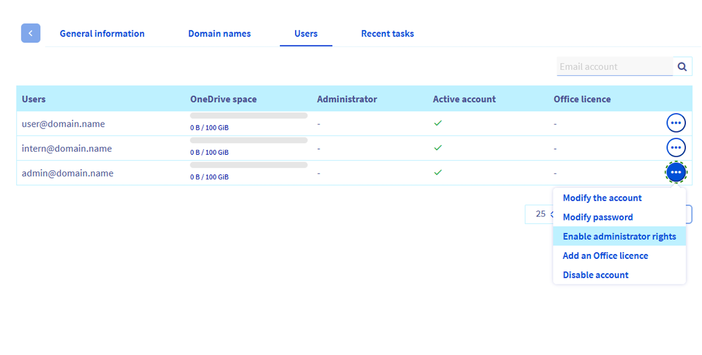
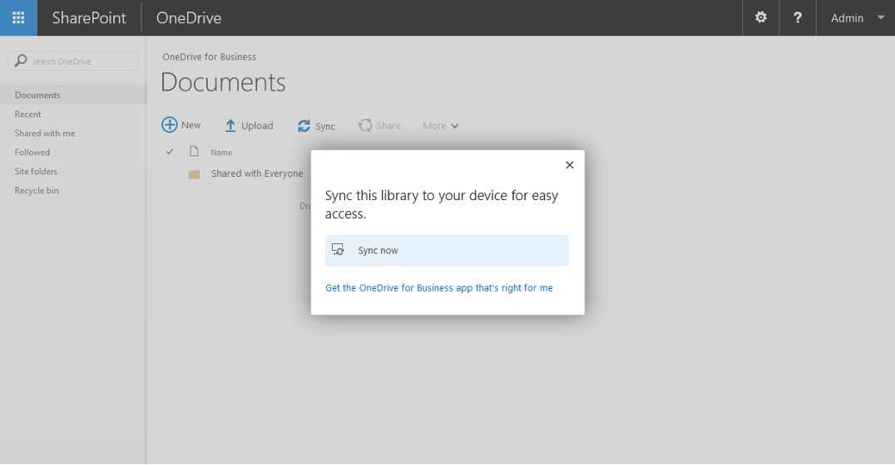
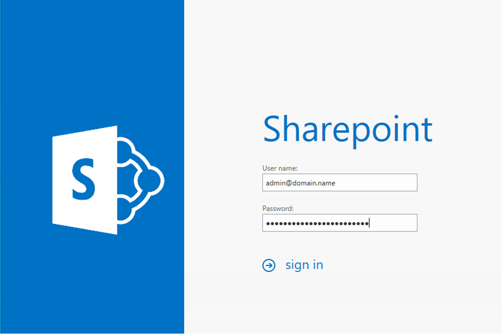
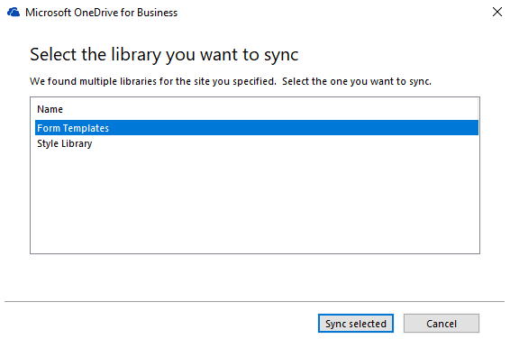

> [!primary]
> Esta tradução foi automaticamente gerada pelo nosso parceiro SYSTRAN. Em certos casos, poderão ocorrer formulações imprecisas, como por exemplo nomes de botões ou detalhes técnicos. Recomendamos que consulte a versão inglesa ou francesa do manual, caso tenha alguma dúvida. Se nos quiser ajudar a melhorar esta tradução, clique em "Contribuir" nesta página.
>

## Objetivo

Se pretende recuperar ou migrar os dados da sua plataforma SharePoint OVHcloud, encontrará neste guia as etapas necessárias para extrair o conjunto dos dados para o armazenamento local do seu computador.

**Saiba como efetuar o backup dos dados do seu Sharepoint OVHcloud no seu computador.**

## Requisitos

- Ter acesso à [Área de Cliente OVHcloud](https://www.ovh.com/auth/?action=gotomanager&from=https://www.ovh.pt/&ovhSubsidiary=pt).
- Dispor de uma [solução Sharepoint OVHcloud](https://www.ovhcloud.com/pt/collaborative-tools/sharepoint/)
- Um computador com o sistema operativo Microsoft Windows instalado para realizar as etapas de migração.

## Instruções

Este guia é dividido em 4 etapas:

- [Etapa 1 - Instalar o OneDrive Enterprise](#installonedrive): a solução OneDrive Entreprise permite-lhe efetuar a transferência dos dados do seu Sharepoint para o seu computador
- [Etapa 2 - Preparar a migração a partir da Área de Cliente OVHcloud](#controlpanelconfig): configure a sua plataforma Sharepoint designando uma única conta de administrador que será capaz de transferir o conteúdo do OneDrive de cada conta Sharepoint.
- [Etapa 3 - Iniciar a migração a partir da sua interface Sharepoint](#migrationignition) : ligue-se à conta designada na etapa 2 para transferir o conteúdo para o seu computador.
- [Etapa 4 - Migrar o conteúdo das outras contas Sharepoint](#migrationother) : siga o processo que permite consultar e sincronizar o espaço OneDrive de cada conta na sua plataforma Sharepoint.

### Etapa 1 - Instalar o OneDrive Entreprise 

Para migrar os dados do seu serviço SharePoint OVHcloud, deve utilizar a aplicação OneDrive Entreprise, cujo nome técnico é « Groove.exe ».

Para instalá-lo, siga as instruções seguintes:

1. Descarregue o ficheiro ISO a partir do link <https://download.mail.ovh.net/sharepoint/onedrive.iso>
2. No seu computador, clique com o botão direito do rato no ficheiro `onedrive.iso`, abra as suas `Propriedades`{.action}, selecione a opção `Desbloquear`{.action}, clique em `Aplicar`{.action} e, a seguir, em `OK`{.action}.
3. Faça duplo clique em `onedrive.iso` para abrir o ficheiro.
4. Faça duplo clique no ficheiro `setup.bat` para iniciar a instalação.
5. Aguarde, pois esta operação pode demorar alguns minutos. **Aguarde que a janela seja fechada** para que a instalação seja concluída.

> [!warning]
>
> Se o ficheiro `setup.bat` não for iniciado corretamente (no etapa 4), pode copiar o conteúdo do ficheiro `onedrive.iso` para uma pasta no ambiente de trabalho do computador e tentar novamente o etapa 4.

{.thumbnail}

> [!primary]
>
> Se esse método não funcionar no seu computador, você pode instalar o OneDrive Enterprise seguindo [o procedimento oficial da Microsoft](https://learn.microsoft.com/sharepoint/install-previous-sync-app#install-groove-exe-with-office-2016).

### Etapa 2 - Preparar a migração a partir da Área de Cliente OVHcloud 

Para aceder ao conjunto dos espaços OneDrive no seu serviço Sharepoint, deve suprimir o direito de administrador de todos os utilizadores através da sua [Área de Cliente OVHcloud](https://www.ovh.com/auth/?action=gotomanager&from=https://www.ovh.pt/&ovhSubsidiary=pt).

Aceda à secção `Web Cloud`{.action} da Área de Cliente. Clique em `Microsoft`{.action} e em `Sharepoint`{.action} e selecione a plataforma SharePoint em causa.

Aceda ao separador `Utilizadores`{.action} para gerir as contas Sharepoint da sua plataforma. Para cada conta, clique no botão `...`{.action} à direita e, a seguir, em `Retirar os direitos de administrador`{.action}.

{.thumbnail}

Depois de retirar o direito de administrador para o conjunto das contas Sharepoint, será necessário designar uma única conta que terá assim acesso ao conjunto dos espaços OneDrive da plataforma.

Ative o direito de administrador na conta que designou.

Ainda no separador `Utilizadores`{.action} da sua plataforma Sharepoint, clique no botão `...`{.action} à direita da conta designada e, a seguir, em `Ativar os direitos de administrador`{.action}.

{.thumbnail}

Pode agora sincronizar o conjunto dos espaços OneDrive da sua plataforma Sharepoint através desta conta.

### Etapa 3 - Iniciar a migração a partir da sua interface Sharepoint 

Aceda à interface online do seu serviço SharePoint. Encontrará o URL de acesso a partir da sua Área de Cliente OVHcloud no separador `Informações gerais`{.action}, na menção Consulta de `URL`.

{.thumbnail}

Inicie sessão com as credenciais do utilizador com direitos de administrador.

{.thumbnail}

Para aceder à secção OneDrive, clique no ícone no canto superior esquerdo da interface Sharepoint e, a seguir, clique no ícone `OneDrive`{.action}.

{.thumbnail}

Para sincronizar o conteúdo do OneDrive no seu computador, clique no botão `Sync`{.action} e, a seguir, em `Sync Now`{.action}.

{.thumbnail}

Aparecerá uma janela onde poderá autorizar o Web site a abrir a ligação **grvopen**. Para o autorizar, selecione a menção "Always allow **https://myServiceAddress.spX.ovh.net** to open **grvopen** links" depois clique em `Abrir a ligação`{.action}.

{.thumbnail}

Introduza as credenciais da conta de Administrador Sharepoint. Utilize o utilizador com direitos de administrador (configurado [na etapa 2](#controlpanelconfig)).

{.thumbnail}

Clique em `Sync Now`{.action}.

{.thumbnail}

Escolha o modelo de biblioteca « **Form Templates** » a partir da janela "Select the library you want to sync". De seguida, clique em `Sync selected`{.action}.

{.thumbnail}

Uma vez terminada esta sincronização no seu computador, apenas os dados da conta Sharepoint à qual está ligado serão transferidos para o seu computador.

**Para transferir o conteúdo dos OneDrive de cada conta da sua plataforma Sharepoint, siga o etapa 4 abaixo.**

### Etapa 3 - Migrar o conteúdo de outras contas Sharepoint 

Para aceder ao espaço OneDrive dos outros utilizadores da sua plataforma e sincronizar os dados associados, deve modificar o URL de acesso (a partir do seu browser) quando estiver ligado ao OneDrive da conta administrador.

Para isso, no URL que aparece, substitua a « secção » (correspondente ao utilizador) que se encontra entre as partes `/personal/` et `/Documents/`.

- **Exemplo 1**: para um utilizador **user@domain.name**, é preciso substituir os caracteres « **@** » e « **.** » por « **_** ». Assim, poderá utilizar « user_domain_name ». Por isso, o seu link terá a seguinte apresentação:

{.thumbnail}

- **Exemplo 2**: para um utilizador **john.smith@exemplo.com**, obtenha « john_smith_exemplo_com ». O seu link terá a seguinte apresentação:

{.thumbnail}

> [!warning]
>
> Os URLs acima são apenas exemplos. Queira utilizar corretamente o URL gerado pela sua plataforma Sharepoint.

Poderá sincronizar as contas seguintes ao reiniciar esta etapa.

## Saiba mais

[Ativar e gerir o seu SharePoint OVHcloud](/pages/web_cloud/email_and_collaborative_solutions/microsoft_sharepoint/sharepoint_manage)

Para serviços especializados (referenciamento, desenvolvimento, etc.), contacte os [parceiros OVHcloud](https://partner.ovhcloud.com/pt/directory/).
Se pretender beneficiar de uma assistência ao uso e à configuração das suas soluções OVHcloud, sugerimos que consulte as nossas diferentes [ofertas de suporte](https://www.ovhcloud.com/pt/support-levels/)

Fale com a nossa comunidade de utilizadores em <https://community.ovh.com/en/>.