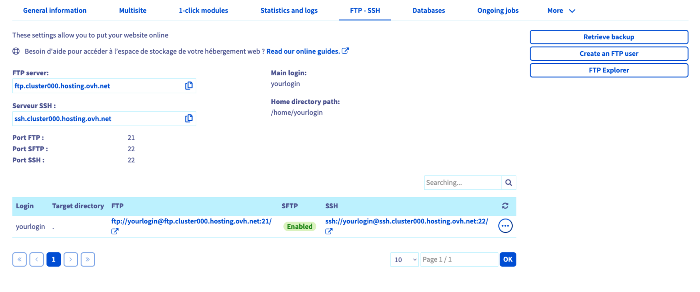

## Objective

This guideline will outline the steps to follow in order to export all elements of your website in a standard format, from an [OVHcloud web hosting plan](https://www.ovhcloud.com/en-sg/web-hosting/).

**Find out how to export an OVHcloud website.**

## Requirements

- an [OVHcloud Web Hosting plan](https://www.ovhcloud.com/en-sg/web-hosting/)
- access to the [OVHcloud Control Panel](https://ca.ovh.com/auth/?action=gotomanager&from=https://www.ovh.com/sg/&ovhSubsidiary=sg)

## Instructions

### Step 1: Retrieve files from your FTP storage space.

#### 1.1 Log in to your storage space.

To log in to your storage space, you will need the following:

- the active FTP or SSH user account
- the FTP or SSH user account password
- the server address
- the server connection port

This information was included in the email informing you that your web hosting plan has been set up. If you don’t have this information, log in to the [OVHcloud Control Panel](https://ca.ovh.com/auth/?action=gotomanager&from=https://www.ovh.com/sg/&ovhSubsidiary=sg){.external}, go to the `Web Cloud`{.action} section, then click on `Hosting`{.action}. Select the name of the web hosting plan, and click on the `FTP - SSH`{.action} tab. 

{.thumbnail}

The information associated with your storage space will now appear. You should be able to find the information you need to log in to it. If you need help with this, please refer to our guide on [Logging in to your Web Hosting plan’s storage space](/pages/web_cloud/web_hosting/ftp_connection). If you are no longer in possession of the password, refer to the instructions set out in our documentation on [Modifying a FTP user password](/pages/web_cloud/web_hosting/ftp_change_password).

Once you have everything you need, there are two different ways of retrieving your files from the storage space:

- **Using FTP- or SFTP-compatible software.** You will need to install a compatible program on your computer (e.g. FileZilla). Since OVHcloud did not create the software package you have installed, please contact the software’s publisher if you are experiencing difficulties using it.

- **Using SSH access.** You will need to use commands from a terminal to interact with your storage space. More advanced knowledge and a specific [OVHcloud hosting plan](https://www.ovhcloud.com/en-sg/web-hosting/) are required to use this type of access. For further information on this, please refer to our guide on [Accessing your web hosting plan via SSH](/pages/web_cloud/web_hosting/ssh_on_webhosting). 

#### 2.1 Upload the files from your storage space.

Once you have logged in to your storage space, all you need to do upload your website files. **Please take special care when you select the repository you have set up your website on.** For standard websites, the files should be uploaded to the “www” folder. However, if you host several websites on your hosting plan, you have almost certainly registered several **Multi-sites**.

To identify the folder that the website is stored on, go to the `Multi-site`{.action} tab in the OVHcloud Control Panel. In the table shown, check the `Root folder`{.action} listed for the domain in question.

{.thumbnail}

### Step 2: Retrieve your database backup (optional).

> [!primary]
>
> This step is optional if your website does not use any databases.
>

To retrieve a backup of your database, please read our guide on
[Retrieving the backup of a Web Hosting plan’s database](/pages/web_cloud/web_hosting/sql_database_export).

### Step 3: Retrieve the logs for your OVHcloud web hosting plan.

If you would like to download your website’s logs, you can do so via your web hosting plan.

Click `Hosting plans`{.action}, then click on the solution concerned. Click the `Statistics and logs`{.action} tab. Then click on the link under `View logs`{.action}:

{.thumbnail}

A window will appear with the different types of logs you can access. They are classed by month:

| Type  	| Description                                                                                                                                                                                         	|
|-------	|-----------------------------------------------------------------------------------------------------------------------------------------------------------------------------------------------------	|
| Web   	| Here, you will find various logs for visiting your website, as well as the different actions taken from your website. You can use this to identify hacking attempts. 	|
| FTP   	| FTP connections will be recorded and stored in these logs.                                                                                                                     	|
| Error 	| These are the errors generated by your website.                                                                                                                                                    	|
| CGI   	| These are the various calls to CGI scripts that have been made.                                                                                                                                     	|
| out   	| These are the statistics of your web hosting plan on different external calls that have been made.                                                                                                                  	|
| ssh   	| These logs indicate the different connections made with SSH protocol.                                                                                                                      	|
| cron  	| These are the result of any jobs you have scheduled.                                                                                                                                                	|

{.thumbnail}

When you have selected the log types and month you want to view, the logs are archived by the day:

{.thumbnail}

## Go further

[Logging in to your Web Hosting plan’s storage space](/pages/web_cloud/web_hosting/ftp_connection)

[Modifying a FTP user password](/pages/web_cloud/web_hosting/ftp_change_password)

[FileZilla user guide](/pages/web_cloud/web_hosting/ftp_filezilla_user_guide)

[Accessing a web hosting plan via SSH](/pages/web_cloud/web_hosting/ssh_on_webhosting)

[Retrieving the backup of a Web Hosting plan’s database](/pages/web_cloud/web_hosting/sql_database_export)

For specialised services (SEO, development, etc.), contact [OVHcloud partners](https://partner.ovhcloud.com/en-sg/directory/).

If you would like assistance using and configuring your OVHcloud solutions, please refer to our [support offers](https://www.ovhcloud.com/en-sg/support-levels/).

Join our community of users on <https://community.ovh.com/en/>.
